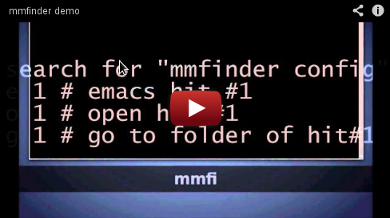

# mmfinder

     updated Feb 2013
     version 0.98 alpha
     author  Marcin Magnus (mag_dex@o2.pl) 
	 license GPLv3
     https://github.com/m4rx9/mmfinder

--------------------------------------------------------------------------------

See http://www.youtube.com/watch?v=-oQ998IWwTc

TABLE OF CONTENTS
-----------------

1. DESCRIPTION
2. INSTALLATION
3. CONFIGURATION
4. HOW TO USE IT
5. BUGS
6. TODO
7. COPYRIGHT AND LICENSE
8. AUTHOR INFORMATION

1. DESCRIPTION
=======================================

``mmfinder`` is a wrapper to *nix commands like ``locate``, ``updatedb``, ``grep``, ``find`` to help you with searching files across several machines (computers). 

Firstly, ``updatedb`` is used by ``mmfinder-deamon`` to create databases. You can define as many "databases" as you want in ``~/.mmfinder-config.py`` file.

The syntax is as follows:

	name_of_computer (you can name it as you want!) = {
		'name_of_database' : 'path_to_folder_for_database'
	}

.. real-world working example ..	

    computer1 = {
        'dropbox' : '/home/magnus/Dropbox',
        'debian'  : '/home/magnus/',
        'StoreJet': '/media/StoreJet',
         }

.. for example, if I have the ``StoreJet`` connected to my computer and I run ``mmfinder-deamon``, a database ``StoreJet`` will be created that includes data from ``/media/StoreJet`` directory.

Next, imagine that at work, you will never mount ``StoreJet``, but you want to create a database for your ``/home`` directory at work. You define another computer (for example, ``computer02 ``) as follows..

    computer2 = {
        'dropbox'  : '/home/magnus/Dropbox',
        'maximus'  : '/home/magnus/',
        'truecrypt': '/media/truecrypt1/',
        }

My recommendation is to use Dropbox (https://www.dropbox.com/home) to put your config file there and make a link (`ln -s`) to your home directory and set the path to your databases like `~/Dropbox/opt/mmfinder/db`. You can share your settings and databases among many computer!

You can also use anything else (http://alternativeto.net/software/dropbox/) but then you need slightly change configuration file.

## Bash plugin

What is realy cool about ``mmfinder`` is that you can have pretty nice functionality if you add to your environment ``bash-plugin.sh``. You can g(o) to hit of result, r(un) it, e(emacs it = open in emacs), o(pen it).. see ``bash-plugin.sh``

2. INSTALLATION
=======================================
To install run:

	sudo pip install mmfinder
	# if you don't have `pip` -> sudo apt-get install python-pip
	
or

	sudo python setup.py install
	
3. CONFIGURATION
=======================================
Go to ``~/.mmfinder-config.py`` ..

to use ``bash-plugin`` add .. 

	case $- in *i*) 
    source /home/magnus/Dropbox/workspace/mmfinder/bash-plugin.sh
	esac
	
.. to your ``.bashrc``

For ``mmfinder-deamon`` you might want to use ``cron`` as follows ..

    00 * * * * /usr/local/bin/mmfinder-deamon

4. HOW TO USE IT
=======================================
Start with configuration, then ``mmfinder.py -u`` or ``mmfinder_deamon.py`` and search ..

      mmfinder -g .bashrc # search for .bashrc across all defined machines

etc..

5. BUGS
=======================================

Report bugs to the author.
	
6. TODO
=======================================

- [ ] make a deb pkg
- [ ] get old TODO from git repo with some TODOs :-)
- [ ] check if all options works
- [ ] write test script

- [ ] how to promote the tool
- [ ] add `tracker-search`
- [ ] find similar tools and compare

**BUGS**

- [ ] problem with filenames with spaces
- [ ] if a folder is found if you hit 'g' you will not get to the folder but to one folder up

7. COPYRIGHT AND LICENCE
=======================================

    mmfinder is Copyright (C) 2013 Marcin Magnus.  All rights reserved.
    
    This program is free software; you can redistribute it and/or modify it
    under the same terms as GLP

8. AUTHOR INFORMATION
=======================================

Marcin Magnus, mag_dex@o2.pl
